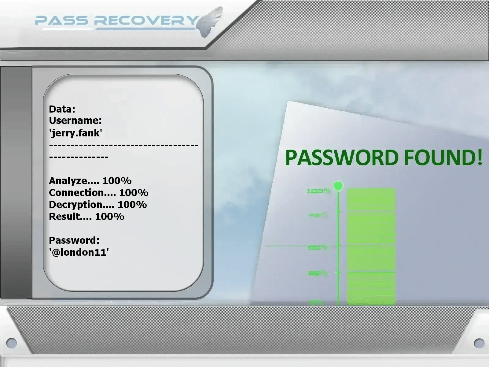

# Outil de Piratage des Comptes X 2026 | À des fins éducatives uniquement


---

## ⚠️ AVIS JURIDIQUE – VEUILLEZ LIRE ATTENTIVEMENT

Ce projet est strictement destiné à l'ÉDUCATION, à la RECHERCHE et aux TESTS DE SÉCURITÉ AUTORISÉS.

Le logiciel s'appuie sur l'API PASS REVELATOR pour démontrer les concepts d'analyse de mots de passe et d'attaques.
Pour plus d'informations sur la protection des comptes X et le piratage de mots de passe, visitez :
www.passwordrevelator.net/fr/passrecovery  ](https://www.passwordrevelator.net/fr/passrecovery)**




- 🚫 Usage illégal interdit : Toute tentative d'accès à des comptes X (Twitter) sans en être propriétaire ou sans consentement explicite est illégale.
- ✅ Autorisation obligatoire : Les tests ne peuvent être effectués que sur des comptes dont vous êtes propriétaire ou pour lesquels vous avez une autorisation écrite d'audit.
- 🔐 Objectif éducatif : Le but est d'identifier les mauvaises pratiques en matière de mots de passe et de promouvoir des habitudes d'authentification plus sécurisées.
- ⚖️ Responsabilité de l'utilisateur : L'utilisateur est seul responsable du respect de toutes les lois applicables.

En utilisant ce logiciel, vous reconnaissez que l'accès non autorisé aux systèmes informatiques est un délit pénal dans de nombreuses juridictions.

---

## 🎯 Aperçu du Projet

Le Testeur de Sécurité des Comptes X (Twitter) est un outil pratique de cybersécurité conçu pour démontrer les concepts de sécurité des mots de passe. Il s'adresse aux professionnels de la sécurité, aux chercheurs et aux étudiants qui souhaitent comprendre les mécanismes d'authentification et les meilleures pratiques de sécurité.

### 🎓 Objectifs Pédagogiques

- Démontrer en toute sécurité les techniques courantes d'attaques par mot de passe
- Évaluer la robustesse des mots de passe sur des comptes X (Twitter) autorisés
- Sensibiliser aux faiblesses de sécurité des identifiants
- Soutenir la formation au hacking éthique et à la cybersécurité
- Explorer les flux d'authentification OAuth2

---

## ✨ Fonctionnalités Principales

### 🔑 Méthodes d'Analyse des Mots de Passe

- Test par Dictionnaire : Vérifie les mots de passe par rapport à des listes de mots standards ou personnalisées
- Génération par Masque : Crée des mots de passe en utilisant des modèles de caractères définis
- Mutations Basées sur des Règles : Applique des transformations courantes aux mots de base
- Stratégies Hybrides : Combine plusieurs techniques pour une couverture plus large

### 🌐 Options de Confidentialité et d'Anonymat

- Rotation automatique des proxys pendant l'exécution
- Support du réseau Tor pour un trafic anonyme
- Limitation adaptative du taux de requêtes
- Randomisation de l'User-Agent et de l'empreinte du navigateur

### 📊 Surveillance en Temps Réel

- Suivi en direct de la progression
- Taux de réussite et statistiques de performance
- Surveillance de l'utilisation des ressources système
- Sortie détaillée des journaux

### 🔒 Gestion Sécurisée de l'Authentification

- Traitement des jetons CSRF
- Flux d'authentification X (Twitter)
- Gestion sécurisée du cycle de vie des sessions
- Mécanismes de détection CAPTCHA

---

## 🚀 Guide d'Installation

### Prérequis

- Python 3.8 ou plus récent
- Gestionnaire de paquets pip
- Connexion Internet active
- Compte Développeur X (Twitter) (pour l'accès à l'API)

### Étape 1 : Cloner le Dépôt

```bash
git clone https://github.com/yourusername/x-account-tester.git  
cd x-account-tester
```

### Étape 2 : Installer les Dépendances

```bash
pip install -r requirements.txt
```

### Dépendances Principales

- tweepy>=4.14.0
- aiohttp>=3.8.0  
- requests>=2.28.0  
- cryptography>=3.4.0  
- stem>=1.8.0  
- psutil>=5.9.0  
- python-dotenv>=0.19.0

### Étape 3 : Configurer l'Accès à l'API X

1. Allez sur le [Portail Développeur X](https://developer.twitter.com/)
2. Créez un nouveau Projet et une Application
3. Générez les clés API et les jetons d'accès
4. Créez un fichier `.env` avec vos identifiants :

```env
CONSUMER_KEY=your_consumer_key
CONSUMER_SECRET=your_consumer_secret
ACCESS_TOKEN=your_access_token
ACCESS_TOKEN_SECRET=your_access_token_secret
```

### Étape 4 : Vérifier l'Installation

```bash
python hack_x.py --help
```

---

## ⚡ Exemples d'Utilisation

### Test de Sécurité Standard

```bash
python hack_x.py --username @utilisateur_cible --password-list mots_de_passe.txt
```

### Test Anonyme via Tor

```bash
python hack_x.py --username @utilisateur_cible --password-list mots_de_passe.txt --use-tor
```

### Test Multi-Threads

```bash
python hack_x.py --username @utilisateur_cible --password-list mots_de_passe.txt --threads 4
```

### Test avec Proxy

```bash
python hack_x.py --username @utilisateur_cible --password-list mots_de_passe.txt --proxy-list proxies.txt
```

---

## 🔥 Modes de Test Supportés

### 1. Audit par Dictionnaire

```bash
python hack_x.py --username @utilisateur_cible --password-list mots_de_passe_courants.txt
```

### 2. Génération de Mots de Passe par Masque

```
?l?l?l?d?d?d   # Exemple : abc123  
?u?l?l?l?d?d   # Exemple : Abcd12  
?l?l?l?l?s?d   # Exemple : abcd!1  
```

### 3. Stratégie de Combinaison

```bash
python hack_x.py --username @utilisateur_cible --strategy combination --base-words "motdepasse,twitter,utilisateur"
```

### 4. Simulation de Force Brute (Usage Pédagogique Uniquement)

```bash
python hack_x.py --username @utilisateur_cible --strategy brute --min-length 4 --max-length 8
```

---

## 📝 Configuration

Créez un fichier `.env` avec vos identifiants d'API X :

```env
# Identifiants API X (Twitter) v2
CONSUMER_KEY=votre_cle_consumer
CONSUMER_SECRET=votre_secret_consumer
ACCESS_TOKEN=votre_jeton_acces
ACCESS_TOKEN_SECRET=votre_secret_jeton_acces

# Paramètres de l'Application
USER_AGENT=XSecurityTester/1.0
TIMEOUT=30
MAX_RETRIES=3
```

## ⚠️ Remarques importantes

- Cet outil est destiné à des fins éducatives uniquement.

- Obtenez toujours une autorisation appropriée avant de réaliser des tests.

- Respectez les limites de débit et les conditions d'utilisation.

- Utilisez des mots de passe forts et uniques et activez l'authentification à deux facteurs (2FA) sur vos comptes.

---

## ⚠️ Considérations juridiques et éthiques

Cet outil est fourni à des fins éducatives et de tests de sécurité autorisés uniquement. Les développeurs déclinent toute responsabilité en cas de mauvaise utilisation ou de dommages causés par ce programme. Il est de la responsabilité de l'utilisateur final de respecter toutes les lois locales, nationales et fédérales applicables.

**IMPORTANT** : Testez uniquement les comptes dont vous êtes propriétaire ou pour lesquels vous disposez d'une autorisation explicite. L'accès non autorisé à des systèmes informatiques est illégal dans la plupart des juridictions.

---

## 📜 Licence

Ce projet est distribué sous licence ECL-2.0 (Educational Community License v2.0). Consultez le fichier LICENSE pour plus de détails.

---

## 🙏 Remerciements

- Équipe de l'API Microsoft Graph

- Communauté de la sécurité open source

- Établissements d'enseignement promouvant la recherche responsable en sécurité
